# SaaS Customer Segmentation and Cohort Analysis

## Overview
This project leverages data science techniques to analyze customer segmentation and behavior over time for a SaaS company. Key metrics such as Customer Retention Rate (CRR), Net Revenue Retention (NRR), Customer Lifetime Revenue (CLR), and Customer Lifetime Value (CLV) are examined to provide actionable insights.

## Technologies Used
- Python Version: 3.11.4
- Libraries: Pandas, Numpy, Matplotlib, Seaborn
- Analytical Tools: Jupyter Notebooks

## Table of Contents
1. [Objective and Methodology](#objective-and-methodology)
2. [Key Metrics](#key-metrics)
3. [Dataset Overview](#dataset-overview)
4. [Libraries and Data Import](#libraries-and-data-import)
5. [Exploratory Data Analysis (EDA)](#exploratory-data-analysis-eda)
6. [Customer Segmentation](#customer-segmentation)
7. [Cohort Analysis](#cohort-analysis)
8. [Customer Retention Rate (CRR)](#customer-retention-rate-crr)
9. [Net Revenue Retention (NRR)](#net-revenue-retention-nrr)
10. [Customer Lifetime Revenue (CLR)](#customer-lifetime-revenue-clr)
11. [Customer Lifetime Value (CLV)](#customer-lifetime-value-clv)
12. [Cohort Layer Cake Analysis](#cohort-layer-cake-analysis)
13. [Results and Conclusions](#results-and-conclusions)
14. [Stakeholder Recommendations](#stakeholder-recommendations)
15. [Recommendations for Further Analysis](#recommendations-for-further-analysis)

## Objective and Methodology
This project aims to perform a comprehensive cohort analysis segmented by first purchase dates and hypothesized product usage groups, aiming to extract actionable insights into customer engagement, retention, and revenue generation. The following are the metrics that will be analyzed:

## Key Metrics
- **Customer Retention Rate (CRR):** The percentage of customers per cohort who continue to make purchases over subsequent periods.
- **Net Revenue Retention (NRR):** The percentage of recurring revenue retained from existing customers over a specified period, including expansions (upsells), contractions (downsells), and churn.
- **Customer Lifetime Revenue (CLR):** The total revenue generated by a customer over their entire relationship with the business. 
- **Customer Lifetime Value (CLV):** The total profit a business can expect from a customer over the entire duration of their relationship. 

## Dataset Overview
The dataset includes customer transaction data with columns such as Order ID, Order Date, Customer ID, Product, Sales, and Profit.

## Libraries and Data Import
``import pandas as pd
import datetime as dt
import numpy as np
import seaborn as sns
import matplotlib.pyplot as plt
import matplotlib.colors as mcolors
import matplotlib.ticker as ticker
from operator import attrgetter
pd.set_option('display.max_rows', None)``

## Loading the dataset
``df = pd.read_csv(r'C:\Users\matth\Downloads\archive.zip', parse_dates=['Order Date'])
df.head(20)``

## Exploratory Data Analysis (EDA)
### Correlation Matrix

#### Key Takeaways from Correlation Matrix
- **Sales and Profit (0.48):** There is a strong positive correlation between sales and profit, indicating that higher sales volumes effectively convert into profits, reflecting a healthy revenue generation mechanism.
- **Sales and Quantity (0.2):** There is a moderate positive correlation between sales and quantity, suggesting that an increase in quantity results in higher sales totals, confirming that operational performance aligns with standard business expectations.
- **Discount and Profit (-0.22):** There is a negative correlation between discount and profit, indicating that higher discounts are associated with lower profits. This highlights the trade-off between discounting strategies and profitability, suggesting potential areas for future analysis to optimize revenue and overall sales.

## Customer Segmentation
To create meaningful customer segments, we categorized products based on common usage patterns and functionalities typical of the SaaS industry. This ensures relevant and insightful segmentation, reflecting typical SaaS offerings and their roles.
### Product Assumptions
- **Marketing Suite:** Tool for managing marketing campaigns, used continuously by marketing teams.
- **FinanceHub:** Essential financial management tool for daily operations.
- **Site Analytics:** Provides continuous insights into website performance.
- **OneView:** Integrated platform for unified business operations.
- **ChatBot Plugin:** Enhances customer service capabilities.
- **Data Smasher:** Advanced data processing tool for specific projects.
- **SaaS Connector Pack:** Adds integration capabilities, usage depends on need.
- **SaaS Connector Pack - Gold:** Premium integration pack with additional features.
- **ContactMatcher:** Tool for specific contact matching tasks, used for short-term projects.
- **Support:** Tool for customer support, used intensively during support operations.
- **Storage:** Additional storage capabilities, usage dependent on storage needs.
- **Big Ol Database:** Specialized database for large-scale data projects.
- **Alchemy:** Tool for complex data transformations, used for specialized tasks.

### Hypothesized Usage Groups
Products are grouped based on usage patterns:
- **Core Services:** Integral to core operations, providing ongoing essential services.
- **Add-ons or Plugins:** Enhance or complement core services, providing additional features or capabilities.
- **Specialized Tools:** Used for specific, non-continuous functions, often project-based.
By understanding the nature of each product, we ensure that our analysis aligns with the business strategy and the intended value proposition.

### Defining Product Categories
``core_services = ['Marketing Suite', 'FinanceHub', 'Site Analytics', 'OneView']
addons_plugins = ['ChatBot Plugin', 'Data Smasher', 'SaaS Connector Pack', 'SaaS Connector Pack - Gold']
specialized_tools = ['ContactMatcher', 'Support', 'Storage', 'Big Ol Database', 'Alchemy']``

This categorization aligns our analysis with expected customer behavior, providing relevant insights. We acknowledge this approach is based on hypotheses and will validate our findings through summary statistics and distribution of key features: Purchase Count, Average Days Between Purchases, and Total Sales.

### Validation Criteria
- Core Services: High mean and low to medium deviation in purchase count and total sales, low mean and low standard deviation in average days between purchases.
- Add-ons or Plugins: Moderate mean and higher standard deviation in purchase count and average days between purchases, moderate mean with higher variance in total sales.
- Specialized Tools: Low mean and high standard deviation in purchase count, high mean and high standard deviation in average days between purchases, low mean with high variance in total sales.

### Usage Group Validation
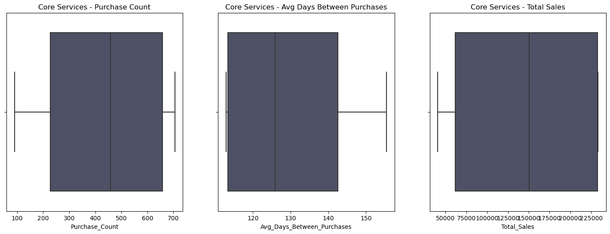

The box plots and summary statistics validate the hypothesized usage patterns:
- Core Services: Consistent and stable usage.
- Add-ons/Plugins: Variable, reflecting their supplementary nature.
- Specialized Tools: Significant variability, confirming their specific, short-term use.

## Cohort Analysis
### Cohort Definition: First Purchase Month
Explanation of cohort definition...

## Metric Calculations

## Customer Retention Rate (CRR)
### CRR by First Purchase Cohort
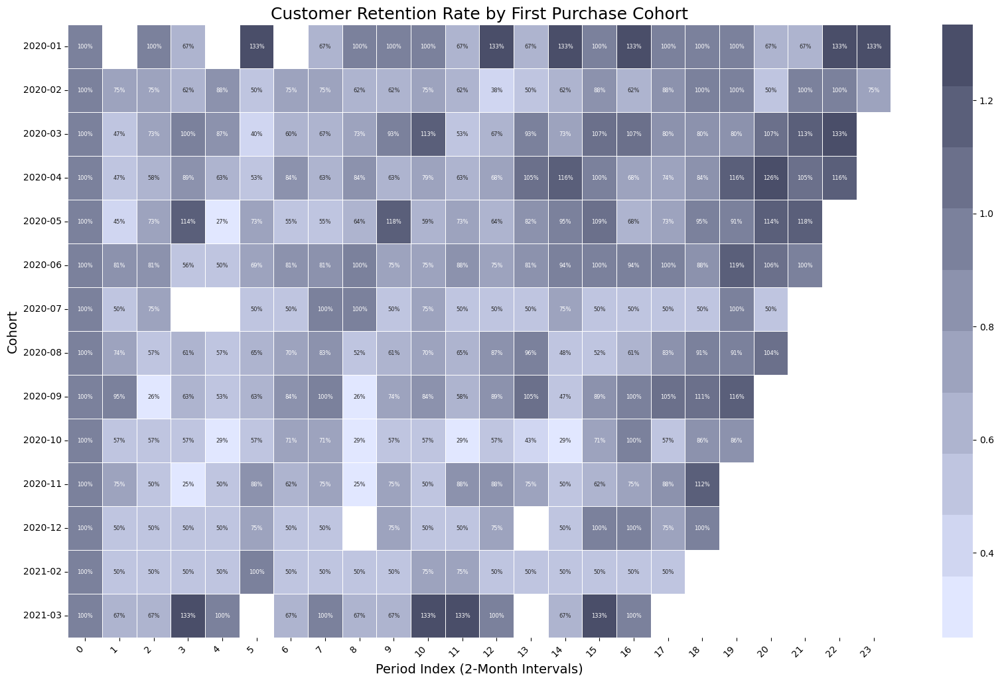
### CRR by Usage Groups

Analysis by usage groups...
### First Month Engagement Metrics
#### CRR Insights
High Initial Retention
Gradual Decline

## Net Revenue Retention (NRR)
### NRR by First Purchase Cohort
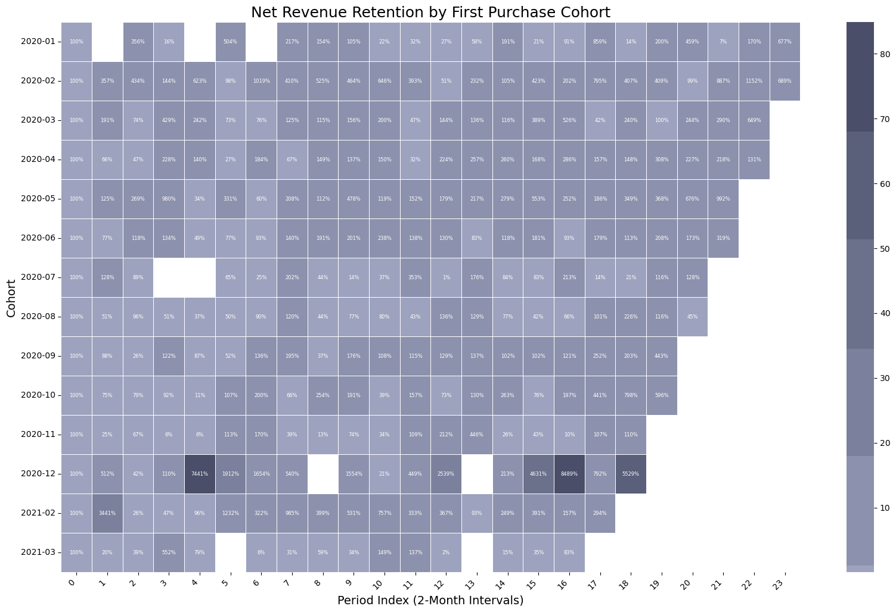
### NRR by Usage Groups

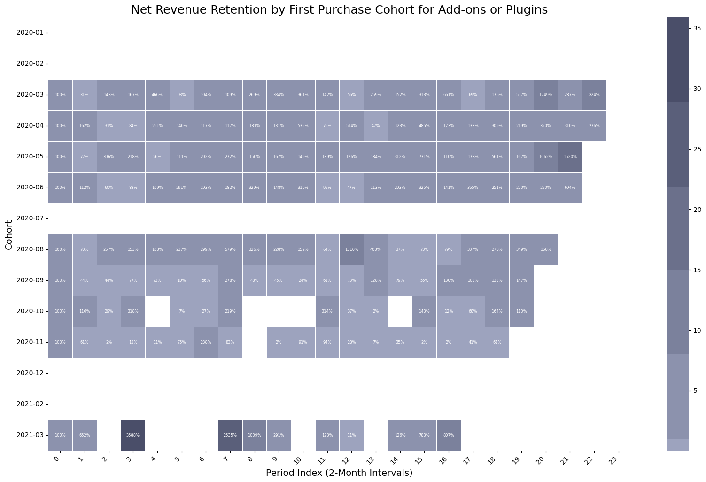

Analysis by usage groups...
### High Revenue Retention Periods
#### NRR Insights
Strong Initial Retention
Healthy Overall NRR

## Customer Lifetime Revenue (CLR)
### CLR by First Purchase Cohort
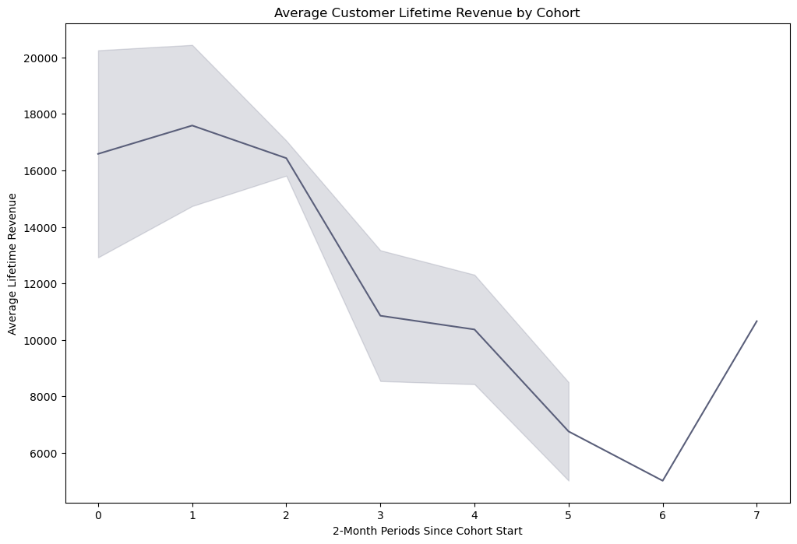
### CLR by Usage Groups

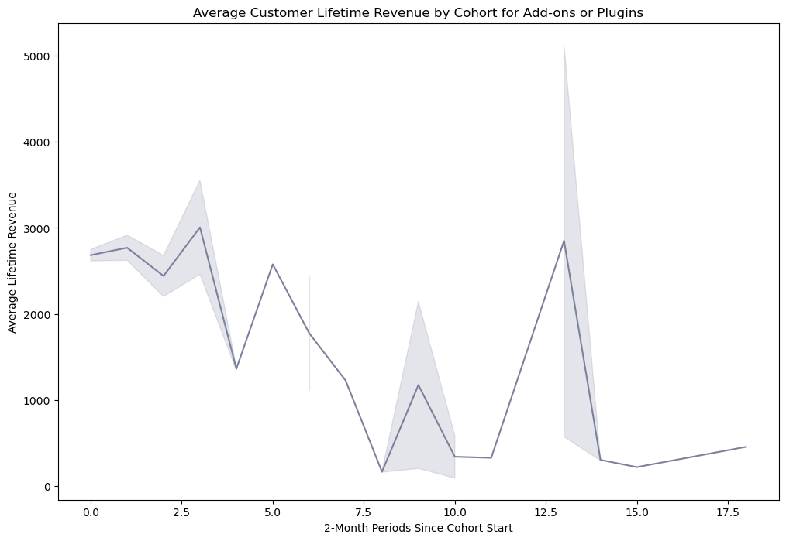

Analysis by usage groups...
#### CLR Insights
Early Success and Decline

## Customer Lifetime Value (CLV)
### CLV by First Purchase Cohort
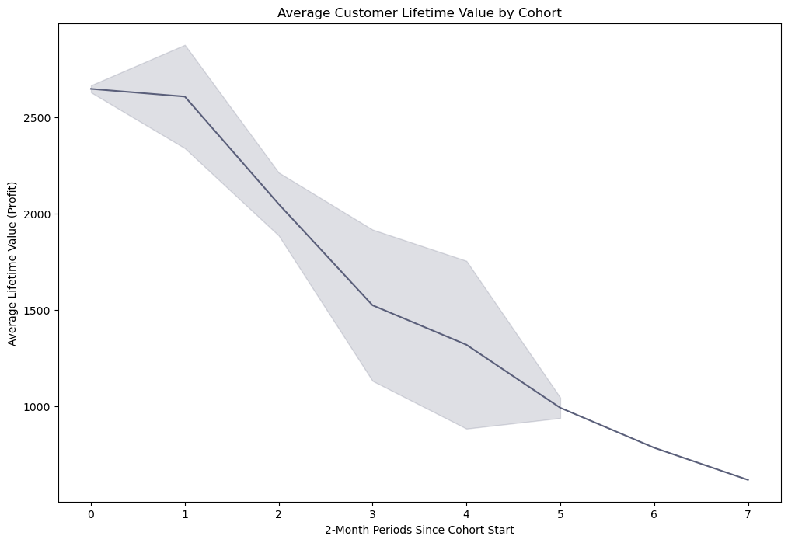
### CLV by Usage Groups
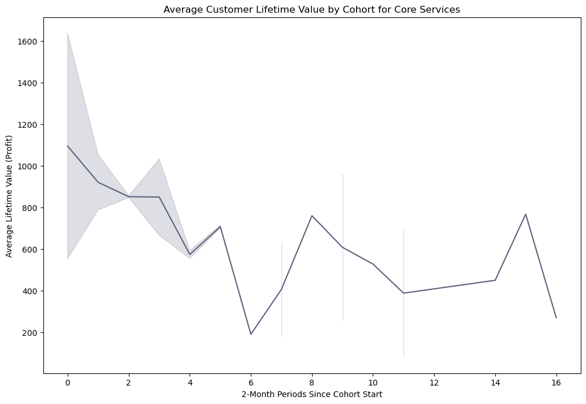
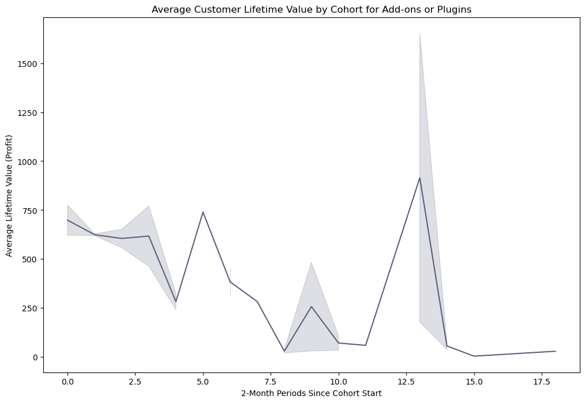
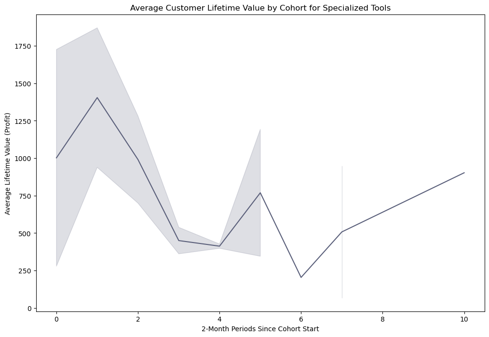
### CLR vs. CLV Cost Efficiency
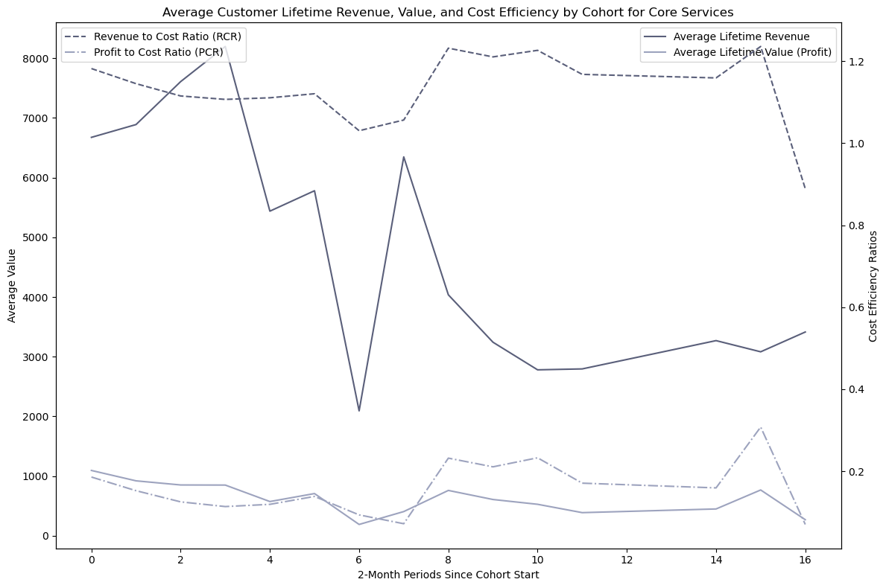
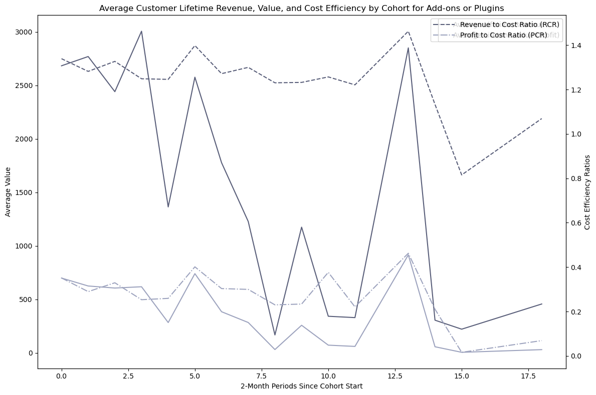

#### CLV Insights
Early Success and Decline
Cost Efficiency Issues

## Cohort Layer Cake Analysis
### CLV Layer Cake by First Purchase Cohort
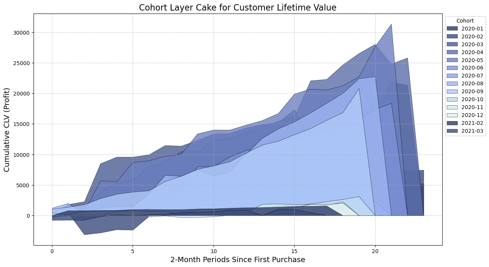
### CLV Layer Cake by Usage Groups

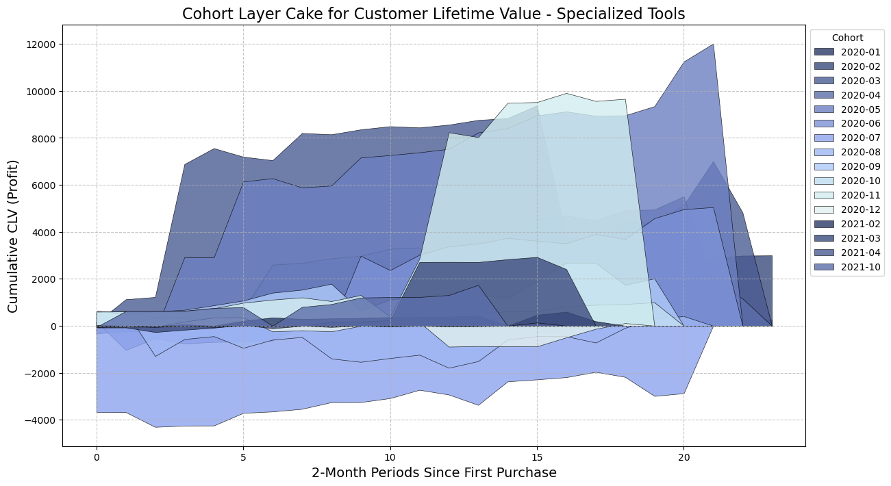
Analysis by usage groups...
#### Cohort Layer Cake Insights
Initial Engagement and Mid-Period Variability
Long-Term Growth

## Results and Conclusions
The analysis highlighted strong initial engagement and successful short-term strategies and the need for improved long-term customer engagement and retention strategies. Recommendations include enhancing long-term engagement, implementing targeted retention strategies, closely monitoring financial performance, leveraging promotions and upselling, and focusing on maintaining the value proposition of core services.

## Stakeholder Recommendations
### Immediate Priorities (High Impact and Urgency)
**Early Engagement and Onboarding**
1. Enhance early engagement with cross-selling and upselling strategies.
2. Develop onboarding programs to ensure new customers quickly see product value.
**Promotions and Upselling**
1. Plan structured schedules for promotions and targeted upselling campaigns.
2. Design targeted marketing campaigns to address specific needs or highlight add-ons at strategic times.
### Mid-Term Priorities (High Impact, Lower Urgency)
**Long-Term Engagement and Retention**
1. Implement regular touchpoints to maintain customer interest over time.
2. Develop targeted campaigns for later-period cohorts.
**Core Services and Long-Term Value**
1. Leverage strong initial engagement to build a robust customer base.
2. Develop value-added services and continuous improvement plans.
**Cost Efficiency and Data-Driven Strategies**
1. Conduct thorough cost analysis to identify and reduce unnecessary expenses.
2. Use customer data to create personalized marketing and engagement strategies.
### Long-Term Priorities (Lower Impact, Lower Urgency)
**Add-Ons and Plugins**
1. Bundle add-ons and plugins with core services.
2. Create targeted marketing strategies to highlight add-ons' value at specific times.
**Specialized Tools**
1. Implement rigorous financial monitoring and management practices.
2. Tailor marketing and engagement strategies to highlight immediate benefits.
**Continuous Improvement and Monitoring**
1. Regularly collect and analyze customer feedback.
2. Build a dedicated customer success team.
3. Regularly monitor and analyze key metrics to adapt strategies in real time.

## Recommendations for Further Analysis
**Churn Prediction**
- Develop a churn prediction model to identify customers at risk of leaving.
- Conduct root cause analysis to understand factors contributing to churn.
**Mapping the Customer Journey**
- Detail the customer journey to highlight key touchpoints and pain points.
- Enhance engagement at each stage to maximize retention.
**Customer Feedback and Sentiment Analysis**
- Analyze customer feedback to identify areas for improvement.
- Establish a continuous feedback loop to address customer needs and preferences.
**Strategic Pricing Analysis**
- Evaluate and optimize pricing models.
- Analyze the impact of discounting strategies on revenue and profitability.
